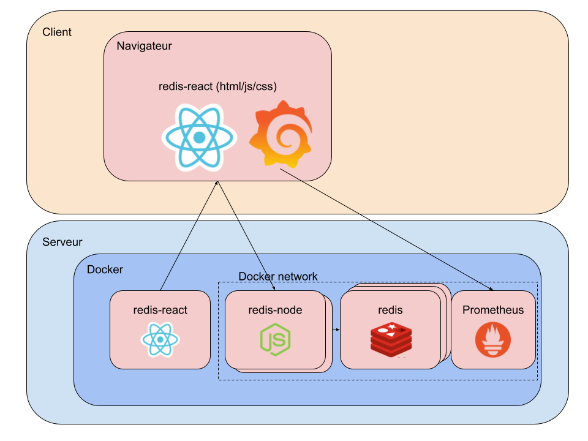

# Autoscalign project (IaC with Ansible):

This project automates the deployment of a full Kubernetes stack using **Ansible**, **Minikube**, **Helm**, **Prometheus**, and **Grafana**.

It provisions and monitors a backend + frontend application with autoscaling enabled.
The deployment is fully reproducible through Ansible roles.


The end result is represented by the following picture : 


## Prerequisites

The following dependencies are needed for the project, though most of them are checked and installed with Ansible:

1. **Minikube**: Used to create a local Kubernetes cluster.\
   - **https://kubernetes.io/fr/docs/tasks/tools/install-minikube/**
     
2. **Kubernetes (kubectl)**: Kubernetes command-line tool to manage your cluster.

   - **https://kubernetes.io/docs/tasks/tools/install-kubectl-linux/**

3. **Helm**: Used to install the Prometheus and Grafana stack from the Helm repository.
    - the installation of helm is included in the shell script, but necessary permissions are required so if needed it can be deleted from the script and downloaded manually

       - https://helm.sh/docs/intro/install/
4. **Docker**: to run minikube with the docker driver:
    - **https://docs.docker.com/engine/install/**
5. **Ansible**: to automate this full project.
---
### User Permissions

- If you're using **Minikube** with the Docker driver, make sure your user is part of the `docker` group. This can be done using the command:

```bash
sudo usermod -ag docker $USER && newgrp docker
```

- You can choose to use Minikube by setting `--driver=none` which will run minikube directly on the machine/VM.

- Ensure you have the necessary user permissions (Ansible will need to download utils that will need it).

## Files Included

- `ansible/playbook.yml`: The ansible playbook that automates the entire deployment process.
- `ansible/clean.yml`: The ansible playbook that cleans the entire thing.
- `Redis-master.yml`, `Redis-replicas.yml`, `BackendDep.yml`, `ReactDep.yml`, `Service-monitoring.yml`: Kubernetes YAML files for the various deployments and configurations.
- `projet-grafana-dashboard.json`: The JSON file used to import the Grafana dashboard.

## Step-by-Step Guide

1. **Prepare Your Environment**:

 - Install **Ansible**.
	```bash
	sudo apt install -y ansible
	```
 - Make sure you have **Docker** installed if you plan to use the Docker driver for Minikube.
 - Make sure your user is in the docker group: `sudo usermod -aG docker $USER && newgrp docker`
2. **Running the deployment**:
 You can deploy everything by running:
```bash
ansible-playbook -i ansible/inventory.ini ansible/playbook.yml --ask-become-pass
```
 This will automatically:

 - Ensures dependencies (kubectl, Helm, Minikube)
 - Start **Minikube** (if not already started).
 - Enable the **metrics-server**.
 - Deploy the Redis master and replicas, backend, and frontend React app.
 - Set up **autoscaling** for both Redis and backend deployments.
 - Install the **Prometheus and Grafana** stack using Helm.
 - Expose **Grafana** and **Prometheus** via `NodePort`.
 - Import a pre-configured **Grafana dashboard**.
 
3. **Cleaning the environment**:

To clean up all Kubernetes resources and delete the minikube profile: 
```bash
ansible-playbook -i ansible/inventory.ini ansible/clean.yml
```
4. **Accessing the Services**:

After running the script, the services will be exposed and you can access them via:

- **Frontend React App**: Access it at `http://192.168.49.2:30002` (local Minikube address).
- **Grafana**: Access it at `http://192.168.49.2:30000` (local Minikube address).
  - Login using `admin` as the username and `prom-operator` as the password.
- **Grafana imported dashboard**: Access it at `http://192.168.49.2:30000/d/aei3q9u5adj40a`

5. **Testing and Autoscaling**:

- To simulate load on the backend, run the following command in a terminal:
  ```
  while true; do curl 192.168.49.2:30001; done
  ```
- In another terminal, monitor the pods with:
  ```
  kubectl get pods -w
  ```
- You can also monitor the **Grafana dashboard** for autoscaling data or use the Minikube dashboard.

6. **Grafana Dashboard**:

After importing the dashboard JSON file (`projet-grafana-dashboard.json`), the dashboard will display:
- Active resources per pod
- Number of total requests received per pod
- Duration of HTTP requests in seconds per pod
- Active resources per type

You can monitor these metrics in real-time using Grafana.

---

## Conclusion

This project automates the entire process of deploying an application with autoscaling, monitoring with Prometheus and Grafana, and setting up an environment using Minikube and Kubernetes. You can easily customize it to fit specific requirements or environments.

For further questions or customizations, refer to the Kubernetes, Helm, Prometheus, and Grafana documentation.
